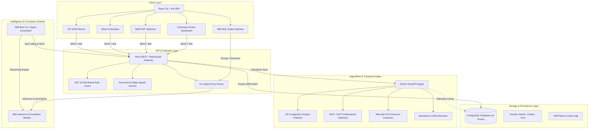

# System Architecture: PortsPilot AI

## System Architecture

PortsPilot AI employs a decoupled, modular architecture built for real-time responsiveness, algorithmic optimization, and enterprise resilience.

---

## Components

| Component | Technology | Responsibility |
|---|---|---|
| **Frontend SPA** | React 18, TypeScript, Vite 6, Tailwind CSS | High-contrast maritime UI, Recharts predictive curves, real-time Gantt operations board, interactive what-if simulation controls. |
| **API Gateway** | Node.js, Hono, TypeScript, `@prisma/client` | High-throughput REST API endpoints, JWT authentication, role guards (port admin vs. shipping agent), document uploads. |
| **Operations Engine** | Python 3.13, FastAPI, NumPy, Pytest | Algorithmic solvers for BAP/CAP berth allocation, multi-horizon congestion prediction (6h–72h), diversion fuel/cost trade-offs, and shift scheduling. |
| **Database** | PostgreSQL / Supabase, Prisma ORM | Relational schema storing vessel manifests, berth specifications, crane telemetry, container yard stacks, shift schedules, and audit trails. |
| **Maritime Copilot** | IBM Bob, watsonx.ai, Gemini | Natural language interface querying telemetry, explaining root causes, synthesizing recovery strategies, and drafting maritime notices. |

---

## Data Flow

1. **Ingestion & State Aggregation**:
   - Vessel position, ETA, draught, and cargo manifests arrive via AIS feeds and shipping agent berth requests.
   - Quayside berth water depths and crane status updates (e.g., Crane C03 operational vs. maintenance) are recorded in PostgreSQL.
2. **Predictive Forecasting (6h–72h)**:
   - Every 15 minutes, the Python Queuing Engine pulls arrival schedules and berth capacities.
   - Evaluates arrival density against crane hourly moves and yard clearance rates to forecast berth utilization curves across 6h, 12h, 24h, 48h, and 72h horizons.
   - Identifies congestion thresholds (>80% utilization) and outputs root-cause contribution weights.
3. **Algorithmic Optimization (BAP/CAP)**:
   - When a bottleneck is flagged, the BAP/CAP solver generates an optimal reallocation (e.g., shifting vessel *Ocean Star* from Berth B04 to B02 with 4 STS cranes).
   - Computes exact operational delta: turnaround hours saved, wait hours eliminated, and demurrage dollars avoided.
4. **Disruption Modeling & Simulation**:
   - Operators can inject simulated events (e.g., sudden 8-hour crane outage).
   - The simulation engine recalculates queue cascades and formulates a 3-step mitigation plan.
5. **Supervisor Approval & Dispatch**:
   - The operator inspects the proposed plan, prompts the IBM Bob Copilot for clarification, and clicks **Apply Recommendation**.
   - Changes propagate atomically across the live Gantt board, shift schedules, and alert center.

---

## Security Considerations

- **Secret Isolation**: All API keys, database credentials, and model tokens are strictly loaded from environment variables (`.env`) and excluded from version control via `.gitignore`.
- **Role-Based Access Control (RBAC)**: Distinct permissions for `admin` (port terminal supervisor) and `ship-agent` (external carrier filing berth requests).
- **Zero-Exposure AI Proxy**: Frontend clients never communicate directly with upstream AI providers; all copilot requests route through an authenticated backend proxy with input sanitization.
- **Relational Integrity & RLS**: Database schemas implement foreign key cascades, unique IMO and Berth identifiers, and Supabase Row-Level Security (RLS) policies.

---

## Scalability Notes

- **Stateless Microservices**: The Python FastAPI engine and Hono gateway are completely stateless, allowing seamless horizontal scaling behind a reverse proxy (e.g., Nginx or cloud ingress).
- **Algorithmic Complexity**: The BAP/CAP optimizer utilizes heuristic bounding to return optimal or near-optimal berth reallocations in sub-second execution time (<80ms), even under high vessel density.
- **Containerized Deployment**: Packaged with multi-stage Dockerfiles ready for immediate deployment to IBM Cloud Code Engine or Kubernetes clusters.
